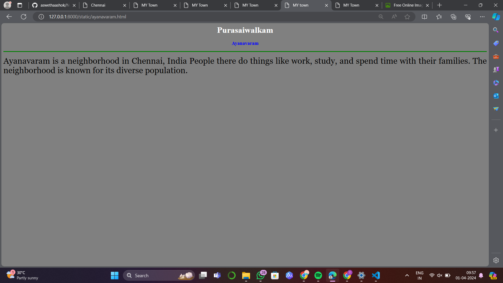
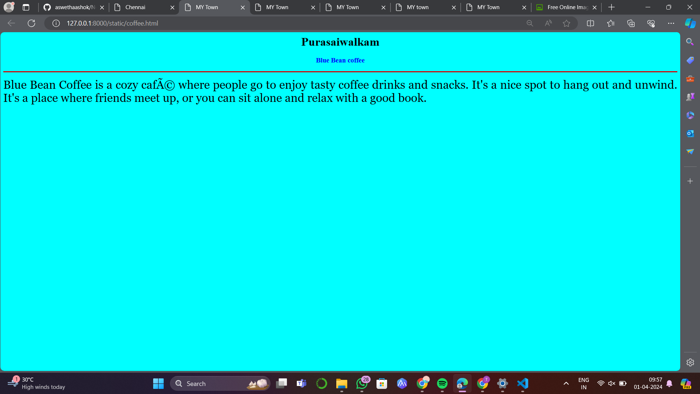
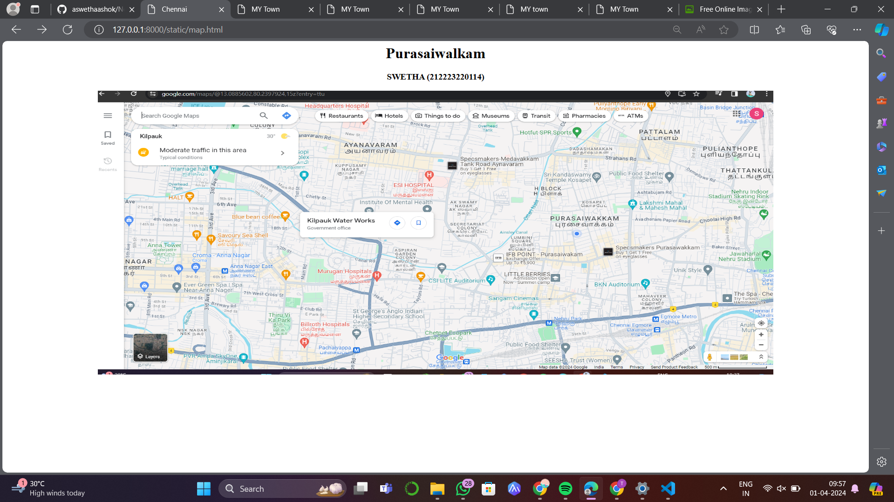
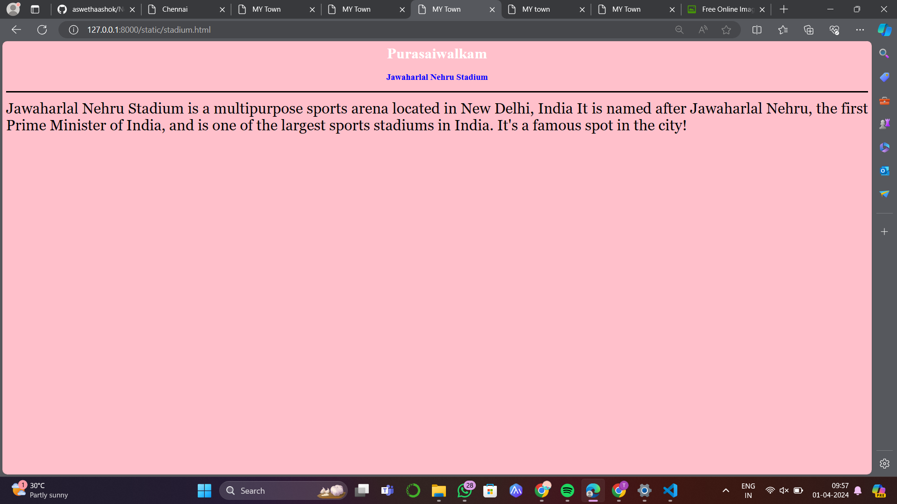
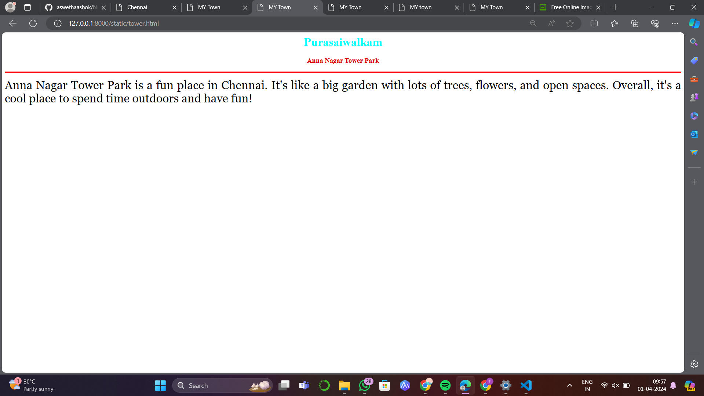

# Ex04 Places Around Me
## Date: 30-03-2024

## AIM
To develop a website to display details about the places around my house.

## DESIGN STEPS

### STEP 1
Create a Django admin interface.

### STEP 2
Download your city map from Google.

### STEP 3
Using ```<map>``` tag name the map.

### STEP 4
Create clickable regions in the image using ```<area>``` tag.

### STEP 5
Write HTML programs for all the regions identified.

### STEP 6
Execute the programs and publish them.

## CODE

### map.html
```
<html>
<head>
<title>Chennai</title>
</head>
<body>
<h1 align="center"><b> Purasaiwalkam </b></h1>
<h3 align="center"><b> SWETHA (212223220114)</b></h3>
<center>

<map name="MyCity">
    <area alt="Swetha Home" title="Purasaiwlakam" href="tower.html" coords="1409,531,1299,445" shape="rect">
    <area alt="stadium" title="" href="stadium.html" coords="1672,511,1887,591" shape="rect">
    <area alt="coffee" title="Blue bean coffee" href="coffee.html" coords="346,379,550,472" shape="rect">
    <area alt="Hospital" title="Murugan Hospital" href="hospital.html" coords="574,706,874,579" shape="rect">
    <area alt="Ayanavaram" title="Ayanavaram" href="ayanavaram.html" coords="857,222,653,159" shape="rect">
</map>
</center>
</body>
</html>

```
### Hospital.html
```
<html>
<head>
<title>MY Town</title>
</head>
<body bgcolor="green">
<h1 align="center">
<font color="yellow"><b>Purasaiwalkam</b></font>
</h1>
<h3 align="center">
<font color="pink"><b>Murugan Hospital</b></font>
</h3>
<hr size="3" color="red">
<p align="justify">
<font face="Georgia" size="6">
    Murugan Hospital is a place where people go when they are sick or hurt
    It's like a big building with doctors, nurses, and other staff who help patients feel better. 
    Overall, Murugan Hospital is a place where people go to get better when they're sick.
</font>
</p>
</body>
</html>
```
### tower.html
```
<html>
<head>
<title>MY Town</title>
</head>
<body bgcolor="white">
<h1 align="center">
<font color="cyan"><b>Purasaiwalkam</b></font>
</h1>
<h3 align="center">
<font color="dark blue"><b>Anna Nagar Tower Park</b></font>
</h3>
<hr size="3" color="red">
<p align="justify">
<font face="Georgia" size="6">
    Anna Nagar Tower Park is a fun place in Chennai.
    It's like a big garden with lots of trees, flowers, and open spaces.
    Overall, it's a cool place to spend time outdoors and have fun!
</font>
</p>
</body>
</html>
```
### coffee.html
```
<html>
<head>
<title>MY Town</title>
</head>
<body bgcolor="cyan">
<h1 align="center">
<font color="black"><b>Purasaiwalkam</b></font>
</h1>
<h3 align="center">
<font color="blue"><b>Blue Bean coffee</b></font>
</h3>
<hr size="3" color="dark pink">
<p align="justify">
<font face="Georgia" size="6">
    Blue Bean Coffee is a cozy café where people go to enjoy tasty coffee drinks and snacks.
    It's a nice spot to hang out and unwind.
    It's a place where friends meet up, or you can sit alone and relax with a good book.
</font>
</p>
</body>
</html>
```
### ayanavaram.html
```
<html>
<head>
<title>MY town</title>
</head>
<body bgcolor="grey">
<h1 align="center">
<font color="white"><b>Purasaiwalkam</b></font>
</h1>
<h3 align="center">
<font color="blue"><b>Ayanavaram</b></font>
</h3>
<hr size="3" color="green">
<p align="justify">
<font face="Georgia" size="6">
    Ayanavaram is a neighborhood in Chennai, India
    People there do things like work, study, and spend time with their families.
    The neighborhood is known for its diverse population.
</font>
</p>
</body>
</html>
```
### stadium.html
```
<html>
<head>
<title>MY Town</title>
</head>
<body bgcolor="pink">
<h1 align="center">
<font color="white"><b>Purasaiwalkam</b></font>
</h1>
<h3 align="center">
<font color="blue"><b>Jawaharlal Nehru Stadium</b></font>
</h3>
<hr size="3" color="black">
<p align="justify">
<font face="Georgia" size="6">
    Jawaharlal Nehru Stadium is a multipurpose sports arena located in New Delhi, India
    It is named after Jawaharlal Nehru, the first Prime Minister of India, and is one of the largest sports stadiums in India. 
    It's a famous spot in the city!
</font>
</p>
</body>
</html>
```

## OUTPUT












## RESULT
The program for implementing image maps using HTML is executed successfully.
